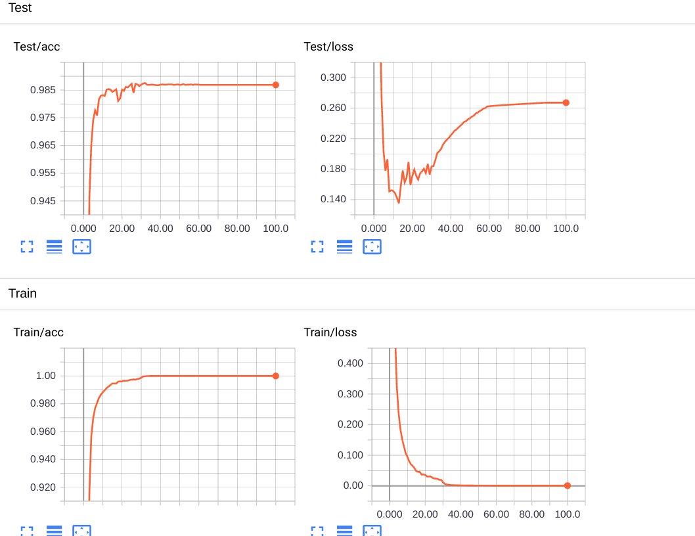

## A-softmax by PyTorch
This an implementation of  [SphereFace: Deep Hypersphere Embedding for Face Recognition](https://arxiv.org/pdf/1704.08063.pdf)

### Requirements
PyTorch(0.4 or later)  
Torchvision  
tensorboardX  
imageio(2.5.0, must be this version)  
matplotlib  
numpy  

### Train
```
$ cd a-softmax
$ python main.py
```
After train, you can get the acc about 98.7%.  All feature picture is in logs/images. The gif(at logs dir) is shown as below.
<div align="center">
  
    
</div>  
The left is feature distribution in train step and the right is in test step.

### look train resulst by tensorboard
```
$ tensorboard --logdir=logs/tblog --port=6006
```
Then you can go to http://0.0.0.0:6006. The results is shown as below:
<div align="center">
    
</div>

### Reference
[1].https://github.com/clcarwin/sphereface_pytorch  
[2].https://github.com/Joyako/SphereFace-pytorch  
[3].https://github.com/woshildh/center_loss  
[4]. https://github.com/wujiyang/Face_Pytorch
